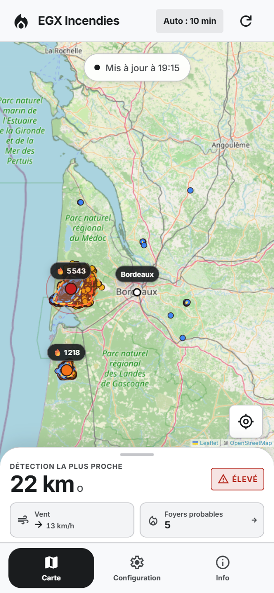
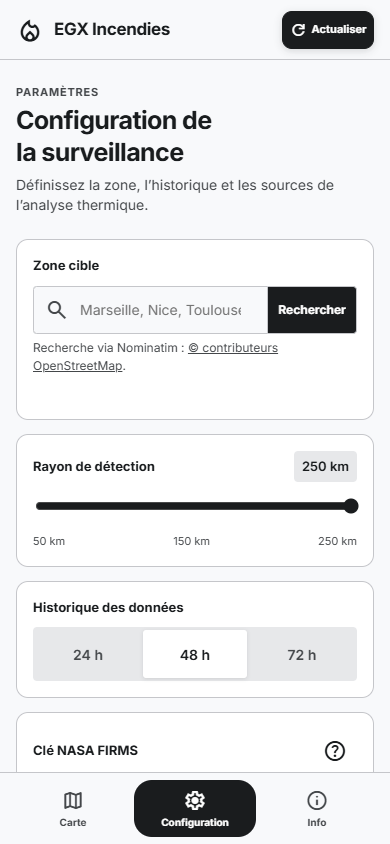
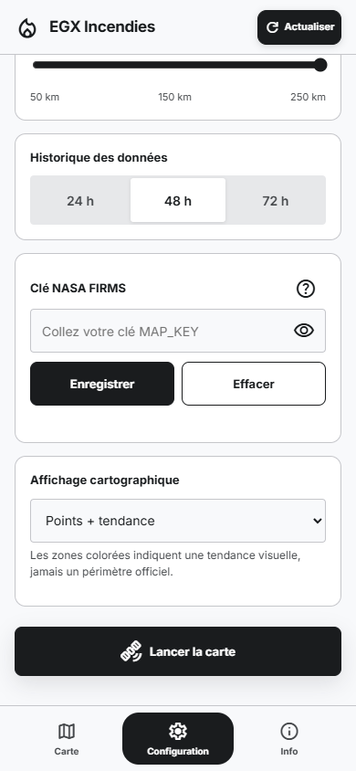
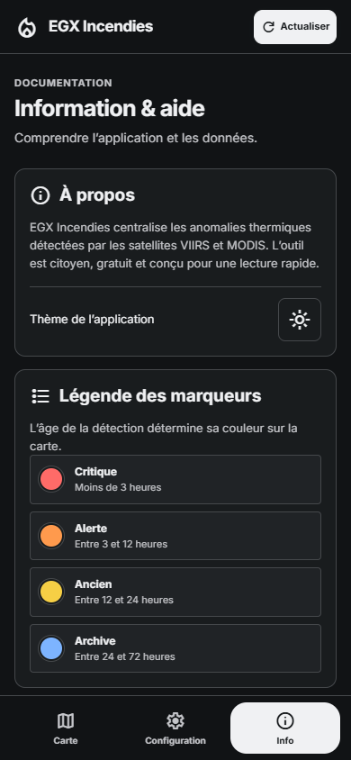

# EGX Incendies

EGX Incendies montre les détections thermiques par satellite autour de la ville de votre choix.

## [Ouvrir EGX Incendies →](https://elgrandexu.github.io/EGX_Incendies/)

## Utiliser l’application en quelques minutes

1. Demandez gratuitement votre [clé NASA FIRMS sur la page officielle](https://firms.modaps.eosdis.nasa.gov/api/map_key/). Entrez votre adresse e-mail. La NASA vous envoie la clé par e-mail.
2. Ouvrez [EGX Incendies](https://elgrandexu.github.io/EGX_Incendies/).
3. Ouvrez l’onglet **Configuration**.
4. Dans **Clé NASA FIRMS**, collez la clé, puis touchez **Enregistrer**.
5. Rouvrez **Configuration** si l’application affiche **Carte**. Dans **Zone cible**, saisissez votre ville, touchez **Rechercher**, choisissez le bon résultat, puis touchez **Utiliser cette ville**. La carte s’ouvre et s’actualise automatiquement.
6. Si besoin, revenez dans **Configuration** pour choisir le **Rayon de détection**, l’**Historique des données** — 24, 48 ou 72 heures — et le mode d’affichage. Chaque changement est appliqué directement.

La clé reste dans le navigateur de cet appareil. Elle sert à interroger NASA FIRMS et n’est pas envoyée à un serveur EGX.

**Raccourci mobile :** sur iPhone ou iPad, ouvrez le site dans Safari, puis touchez **Partager** → **Sur l’écran d’accueil**. Sur Android, ouvrez-le dans Chrome, puis choisissez **Ajouter à l’écran d’accueil** dans le menu. Une connexion à Internet reste nécessaire.

> [!IMPORTANT]
> En cas de danger immédiat, appelez le **112** ou le **18**. Suivez toujours les consignes des autorités et des services de secours.

## Ce que l’application affiche

- les détections thermiques fournies par NASA FIRMS ;
- les détections proches regroupées en foyers probables ;
- la distance et l’ancienneté de la détection la plus proche ;
- le vent actuel ;
- un niveau de risque pédagogique lié aux fumées ;
- les directions possibles des fumées, représentées par des flèches sur la carte ;
- le détail de chaque foyer probable ;
- les localités potentiellement situées dans l’axe estimé, uniquement dans le détail ;
- un thème clair et un thème sombre.

Les informations évoluent avec les données reçues. Quand l’application reste ouverte, elle les actualise toutes les 10 minutes.

## Repères dans l’application

<table>
  <tr>
    <td width="50%" valign="top">
      
      <br><sub><strong>Carte.</strong> Les indicateurs essentiels restent visibles sous la carte.</sub>
    </td>
    <td width="50%" valign="top">
      
      <br><sub><strong>Configuration.</strong> Choisissez la ville, le rayon et la période observée.</sub>
    </td>
  </tr>
  <tr>
    <td width="50%" valign="top">
      
      <br><sub><strong>Clé NASA FIRMS.</strong> Collez la clé dans ce champ, puis touchez Enregistrer.</sub>
    </td>
    <td width="50%" valign="top">
      
      <br><sub><strong>Info.</strong> Le bouton en forme de soleil ou de lune change le thème.</sub>
    </td>
  </tr>
</table>

Les captures montrent la version mobile actuelle. La clé NASA n’apparaît dans aucune image.

## Utiliser les trois onglets

### Carte

- Consultez les détections et les foyers probables.
- Lisez la distance la plus proche, le vent et le risque lié aux fumées.
- Suivez les corridors neutres et les flèches pour lire la direction potentielle des fumées, sans échéance temporelle précise.
- Utilisez la case **Trajectoires de fumée** sur la carte pour les afficher ou les masquer instantanément.
- Touchez un foyer, son corridor ou une flèche pour ouvrir ses détails.
- Dans le détail, consultez la tendance des vents et les localités potentiellement dans l’axe.
- Touchez **Foyers probables** pour consulter la liste.

### Configuration

- Recherchez une ville et choisissez le bon résultat.
- Modifiez le rayon de détection.
- Choisissez une période de 24, 48 ou 72 heures.
- Affichez les points, la tendance visuelle, ou les deux.
- Enregistrez ou remplacez votre clé NASA FIRMS.

Les zones colorées montrent une tendance visuelle. Elles ne représentent pas un périmètre officiel d’incendie.

### Info

- Consultez la légende et les sources.
- Retrouvez les informations de sécurité.
- Dans le bloc **À propos**, touchez le bouton en forme de lune ou de soleil pour passer du thème clair au thème sombre.

Sur ordinateur, les mêmes contenus restent accessibles dans le panneau placé à droite de la carte.

## Données et confidentialité

- **NASA FIRMS** fournit les détections thermiques.
- **Open-Meteo** fournit les informations sur le vent.
- **OpenStreetMap** fournit la carte et les noms des localités, via Overpass.
- **Nominatim**, un service d’OpenStreetMap, recherche les villes.

EGX Incendies ne demande aucun compte. EGX n’ajoute aucun outil de suivi publicitaire ou de mesure d’audience. Aucun renseignement personnel n’est envoyé à un serveur EGX.

La clé NASA, la ville et les préférences restent dans le navigateur de l’appareil. Si vous effacez les données du site dans le navigateur, ces réglages peuvent aussi être supprimés.

## Ce que l’application ne peut pas garantir

- Une détection thermique n’est pas toujours un incendie. Elle peut venir d’un brûlage, d’un site industriel ou d’une autre source de chaleur.
- Les satellites ne survolent pas une zone en continu.
- Les nuages, la fumée ou un retard de transmission peuvent masquer ou retarder certaines détections.
- Les foyers probables sont des regroupements automatiques. Ils ne confirment pas un incendie distinct.
- Les trajectoires de fumées sont des estimations pédagogiques fondées sur les vents prévus à 10 m. Elles ne constituent pas un modèle de dispersion, une mesure de fumée ou une prévision des flammes.
- Une localité affichée est seulement située dans l’axe géométrique estimé. Elle ne définit ni une zone de danger ni une consigne d’évacuation.
- L’application ne mesure pas la qualité de l’air.
- L’absence de détection ne signifie pas l’absence de danger.
- L’application ne remplace ni les autorités, ni les alertes officielles, ni les services d’urgence.

## En cas d’urgence

En cas de danger immédiat :

- appelez le **112** ;
- ou appelez le **18**.

Éloignez-vous du danger si les autorités vous le demandent. Suivez les consignes officielles locales.

## Informations techniques

Le projet utilise trois fichiers à la racine du dépôt :

- `index.html` contient la structure de l’application ;
- `style.css` contient la présentation responsive et les thèmes ;
- `app.js` charge les données et gère les interactions.

L’application fonctionne sans serveur EGX et sans étape de compilation. GitHub Pages publie le site. Elle interroge NASA FIRMS, Open-Meteo, OpenStreetMap et Nominatim.

Pour l’ouvrir en local, servez la racine du dépôt avec un serveur HTTP. Par exemple, lancez `python -m http.server 8000`, puis ouvrez `http://localhost:8000/`.

Le banc navigateur contrôlé est conservé dans `validation/mission2-browser.cjs`. Il nécessite Node.js 22 ou plus récent et Chrome ou Chromium. Lancez :

```sh
node validation/mission2-browser.cjs
```

Le navigateur est détecté dans les emplacements courants. Sinon, définissez la variable `CHROME_PATH`. Le banc vérifie l’intégrité de Leaflet, simule les réponses réussies, partielles et échouées des API, puis teste les parcours sur mobile, tablette et ordinateur.

Le rapport factuel, les mesures avant/après, les limites et la procédure de rollback sont consignés dans [`docs/audit-2026-07-26.md`](docs/audit-2026-07-26.md).

## Licence

Le projet est distribué sous licence MIT. Consultez le fichier [`LICENSE`](LICENSE).
